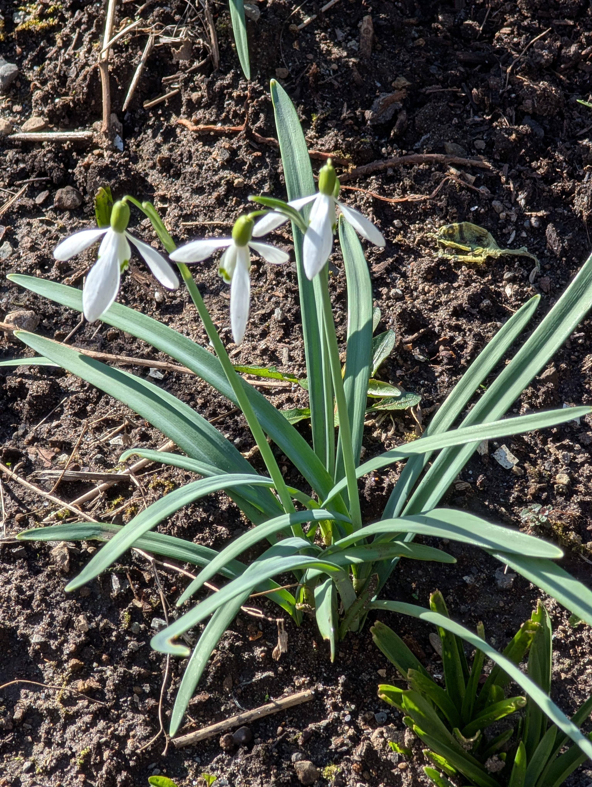

Reading time: `r ifelse(file.size("index.qmd")/2000 <= 1.5, '<1 minute', paste0(round(file.size("index.qmd")/2000), ' minutes'))`

```{r}
#| echo: false
library(flextable)
library(tidyverse) # library for datascience
library(huxtable) # library for making tables pretty
library(ggpubr) # library for making plots pretty
library(ggvenn) # library to make venn diagram
library(ggalluvial)
library(googlesheets4)
library(dplyr)
library(ggtext)
```

```{r}

#| echo: false

library(purrr)

cache_file <- "data/sheet_data.rds"

if (file.exists(cache_file)) {
  data <- readRDS(cache_file)
} else {
  googlesheets4::gs4_auth(email = "katquayle@gmail.com")
  data <- googlesheets4::read_sheet(
    "1cdAFGR27Cjc5_ULx7GhgynhcB7n7jzgeKvldJzg8ous"
  ) |>
    mutate(temp_dec_previous = map_dbl(temp_dec_previous, ~ {
      if (length(.x) == 0) NA_real_ else as.numeric(.x[[1]])
    }))
  dir.create("data", showWarnings = FALSE)
  saveRDS(data, cache_file)
}
```

# Flowers in January

{fig-align="center" width="151"}

Many of us here in Southwestern BC are finding recent winters warmer and dryer than in the past, with spring flowers blooming in January that typically wouldn't appear for another month or two. Citizen scientists have been contributing an abundance of data in the public domain using various apps designed to document nature. This crowd-sourced data lets us take stock of changes in ecology, climate, and plant phenology - the study of plant life cycles and how environmental factors may influence them

Temperature is a well established driver of flowering time in spring, with many studies showing warming-induced shifts in phenology toward earlier flowering start, as well as later cessation of flowering, and longer flowering duration ([Menzel et al, 2006](Menzel,%20A.,%20et%20al.%202006.%20European%20phenological%20response%20to%20climate%20change%20matches%20the%20warming%20pattern.%20Global%20Change%20Biology%2012:%201969–1976.); [Dawson-Glass, 2025](https://academic.oup.com/aob/article/135/6/1029/7966703); [A.G. Aufrett, 2021](https://esajournals.onlinelibrary.wiley.com/doi/full/10.1002/ecs2.3683); [Büntgen et al, 2022](https://royalsocietypublishing.org/rspb/article/289/1968/20212456/79326); [Parmesan and Yohe, 2023](https://courses.geo.utexas.edu/courses/387H/Lectures/parmesan.pdf)).

Mean temperatures in the month before blooming have been shown to influence timing of early spring flowering ([Fitter and Fitter, 2002](https://www.montana.edu/screel/teaching/bioe-370/documents/Science-2002-Fitter-1689-91.pdf)). More recently, crowd-sourced data from an annual New year Plant Hunt in the UK ([press release](https://bsbi.org/about/news/press-releases/hundreds-of-wild-flowers-bloom-in-midwinter)) has shown that for every 1 °C rise in temperature in the months prior to the plant hunt, an average of 2.5 additional species are in bloom on January 1 ([Met Office, 2026](https://www.metoffice.gov.uk/about-us/news-and-media/media-centre/weather-and-climate-news/2026/new-year-plant-hunt-reveals-influence-of-rising-temperatures-on-british-and-irish-flora)).

In Canada, one of the earliest crowd-sourced data analyses of first bloom day utilized records from PlantWatch Canada ‘Citizen Science’ networks from 2001-2012 ([Gonsamo et al., 2013](https://www.nature.com/articles/srep02239.pdf)). These authors found flower blooming advanced by about 9 days over a 12 year period in 19 plant species, which correlated with 1 °C of warming - notably, records are missing for British Columbia.

With these findings as inspiration, we went to iNaturalist for crowd-sourced data on flowering plants in our region to see what we could find out about early flowering patterns here.

<br>

### Data sources

A dataset was constructed of plants that flower in January in BC as documented in iNaturalist with associated ecoregion, and weather data. This was done in 4 steps:

1.  Download of flowering plants (search terms Angiospermae, research grade) observations in BC, in January from [iNaturalist](https://inaturalist.ca/observations?month=1&place_id=7085&quality_grade=research&taxon_id=47125) (N=27,057, exported 14 Feb, 2026).
2.  Extraction of images from the dataset followed by Image sorting with [Pl\@ntNet](https://plantnet.org/en/) to enable labelling of those 'with' and 'without' flowers. Photos of plants labelled ‘with’ flowers were manually examined to remove incorrect assignments.
3.  Data was merged with Ecoregion Ecosystem and Biogeoclimatic Ecosystem data from the [BC data catalogue](https://catalogue.data.gov.bc.ca/dataset/ecoregions-ecoregion-ecosystem-classification-of-british-columbia) based on latitude and longitude of plant observations.
4.  Vancouver, BC weather data from [weatherstats.ca](https://www.weatherstats.ca/) was incorporated into the analyses.

### What we found

##### January flowers in BC

The flowering plant dataset contains 27,057 total observations (1980 to 2026). Very few observations were collected before 2019 (N=253) with annual counts ranging from 1-69. Because observations were sparse prior to 2019, the analyses were restricted to 2019 to 2026 (N=26,804; Table 1). Note that there may be additional observations added after our iNaturalist download date, particularly for January 2026.

Table 1. iNaturalist observations of flowering plants in January in BC

```{r}
#| echo: false
# Step 1: create year_table
year_table <- data %>%
  filter(!is.na(year), !is.na(inat_scientific_name), year >= 2019, year <= 2026) %>%
  group_by(year) %>%
  summarise(
    Number_of_Observations = n(),
    .groups = "drop"
  ) %>%
  arrange(year)

# Step 2: render table
year_table %>%
  flextable::flextable() %>%
  flextable::set_header_labels(
    year = "Year", Number_of_Observations = "Observations"
  ) %>%
  flextable::colformat_num(j = "year", big.mark = "", digits = 0) %>%
  flextable::autofit() %>%
  flextable::bold(part = "header") %>%
  flextable::bg(part = "header", bg = "#389475") %>%
  flextable::color(part = "header", color = "white") %>%
  flextable::border_outer() %>%
  flextable::border_inner() %>%
  flextable::align(align = "center", part = "all") %>%
  flextable::fontsize(size = 9, part = "all") %>%
  flextable::hrule(rule = "exact", part = "all") %>%
  flextable::height(height = 0.3, part = "body") %>%
  flextable::height(height = 0.2, part = "header")
```

<br>

Plants were documented in 8 of BC's 9 ecoprovinces, with the vast majority of observations (95%) from the Georgia Depression; the most temperate and populated region of the province. Plants in bloom were documented in 6 ecoprovinces (Fig 1, Table 2).

<br>

**Figure 1. Ecoprovinces of BC**

](images/ecoprovinces.png){fig-align="center" width="430"}

<br>

Table 2. iNaturalist observations of plants in January in BC

```{r}
#| echo: false
flower_table <- data %>%
  filter(!is.na(ecoprovince_name), ecoprovince_name != "") %>%
  filter(!is.na(year), !is.na(inat_scientific_name), year >= 2019, year <= 2026) %>%
  group_by(ecoprovince_name) %>%
  summarise(
    Total_Observations = n(),
    Without_Flower = sum(So_is_there_a_flower == FALSE | So_is_there_a_flower == "No" | So_is_there_a_flower == 0, na.rm = TRUE),
    With_Flower = sum(So_is_there_a_flower == TRUE | So_is_there_a_flower == "Yes" | So_is_there_a_flower == 1, na.rm = TRUE),
    .groups = "drop"
  ) %>%
  arrange(desc(Total_Observations))

totals_row <- flower_table %>%
  summarise(
    ecoprovince_name = "Total",
    Total_Observations = sum(Total_Observations),
    With_Flower = sum(With_Flower),
    Without_Flower = sum(Without_Flower)
  )

flower_table_with_totals <- bind_rows(flower_table, totals_row)

flower_table_with_totals %>%
  flextable::flextable() %>%
  flextable::set_header_labels(
    ecoprovince_name = "Ecoprovince",
    Total_Observations = "Total Observations",
    With_Flower = "Blooming",
    Without_Flower = "Not blooming"
  ) %>%
  flextable::autofit() %>%
  flextable::fit_to_width(max_width = 6.5) %>% 
  flextable::bold(part = "header") %>%
  flextable::bold(i = nrow(flower_table_with_totals), part = "body") %>%
  flextable::bg(part = "header", bg = "#389475") %>%
  flextable::bg(i = nrow(flower_table_with_totals), bg = "#d0ece4", part = "body") %>%
  flextable::color(part = "header", color = "white") %>%
  flextable::border_outer() %>%
  flextable::border_inner() %>%
  flextable::align(align = "center", part = "all") %>%
  flextable::align(j = 1, align = "left", part = "all") %>%
  flextable::fontsize(size = 7, part = "all") %>%
  flextable::hrule(rule = "exact", part = "all") %>%
  flextable::height(height = 0.22, part = "body") %>%
  flextable::height(height = 0.22, part = "header") %>%
  flextable::padding(padding = 2, part = "all")
```

Note: location information obscured for 2 observations

<br>

Between 2019 and 2026, 690 plant species were observed in January; of these, 151 (21.9%) were in bloom. The annual number ranged from a low of 186 species (36 in bloom) in 2020 to a high of 412 species (79 in bloom) in 2025 (Fig 2). The percentage of plants in bloom ranged from a low of 6.8% in 2023 to a high of 19.4% in 2020.

<br>

<br>

Figure 2. Flowering plant species observed in January in BC 2019-2026

```{r}
#| echo: false
#| fig-width: 10
#| fig-height: 4
library(dplyr)
library(ggplot2)


plot_data <- data %>%
  filter(!is.na(year), !is.na(inat_scientific_name), year >= 2019, year <= 2026) %>%
  group_by(year) %>%
  summarise(
    total_species = n_distinct(inat_scientific_name),
    flower_species = n_distinct(inat_scientific_name[So_is_there_a_flower == "Yes"]),
    .groups = "drop"
  )

ggplot(plot_data, aes(x = year)) +
  geom_line(aes(y = total_species, color = "Total number of species"), linewidth = 1) +
  geom_point(aes(y = total_species, color = "Total number of species"), size = 3) +
  geom_line(aes(y = flower_species, color = "Species in Flower"), linewidth = 1) +
  geom_point(aes(y = flower_species, color = "Species in Flower"), size = 3) +
  scale_color_manual(values = c("Total number of species" = "#2196F3", "Species in Flower" = "#389475")) +
  scale_x_continuous(breaks = 2019:2026) +
  labs(
    x = "Year",
    y = "Number of Species",
    color = "Legend"
  ) +
  theme(
  legend.position = "right",
  panel.grid.minor = element_blank(),
  panel.grid.major = element_blank(),
  panel.background = element_blank(),
  axis.line = element_line(color = "black")
)
```

\newpage

Of the 151 species in bloom in January throughout BC, 116 species were unique to the Georgia Depression, 14 species were unique to the other ecoprovinces combined, and 21 species were found in the Georgia Depression and one or more other ecoprovinces (Fig 3, Table 3).

Figure 3. Regional distribution of plants in bloom in January 2019-2026

```{r}
#| fig-align: center
georgia <- data %>%
  filter(
    ecoprovince_name == "GEORGIA DEPRESSION",
    as.numeric(year) >= 2019,
    as.numeric(year) <= 2026,
     So_is_there_a_flower == "Yes"
  ) %>%
  pull(inat_scientific_name) %>%
  unique()

other <- data %>%
  filter(
    ecoprovince_name != "GEORGIA DEPRESSION",
    as.numeric(year) >= 2019,
    as.numeric(year) <= 2026,
     So_is_there_a_flower == "Yes"
  ) %>%
  pull(inat_scientific_name) %>%
  unique()

library(ggvenn)
ggvenn(
  list("Georgia Depression" = georgia, "Other Ecoprovinces" = other),
  fill_color = c("#389475", "#2196F3"),
  stroke_size = 0.5,
  set_name_size = 3,
  text_size = 3
)

```

Table 3. List of plants in bloom in different regions of BC in January 2019-2026

<br>

```{r}
data %>%
  filter(
    !is.na(ecoprovince_name),
    !is.na(inat_common_name),
    So_is_there_a_flower == "Yes",
    year >= 2019,
    year <= 2026
  ) %>%
  mutate(inat_common_name = str_to_sentence(tolower(inat_common_name))) %>%
  distinct(ecoprovince_name, inat_common_name) %>%
  group_by(ecoprovince_name) %>%
  summarise(species = paste(sort(inat_common_name), collapse = ", "), .groups = "drop") %>%
  flextable::flextable() %>%
  flextable::set_header_labels(
    ecoprovince_name = "Ecoprovince",
    species = "Common Name"
  ) %>%
  flextable::autofit() %>%
  flextable::bold(part = "header") %>%
  flextable::bg(part = "header", bg = "#389475") %>%
  flextable::color(part = "header", color = "white") %>%
  flextable::border_outer() %>%
  flextable::border_inner() %>%
  flextable::align(j = 1, align = "left", part = "all") %>%
  flextable::align(j = 2, align = "left", part = "all") %>%
  flextable::fontsize(size = 7, part = "all") %>%
  flextable::width(j = 1, width = 1.2) %>%
  flextable::width(j = 2, width = 5.5) %>%
  flextable::hrule(rule = "exact", part = "header") %>%
  flextable::height(height = 0.2, part = "header") %>%
  flextable::padding(padding = 2, part = "all")
```

<br>

##### Effects of winter temperatures on January blooming

For these analyses, we restricted the dataset to observations in the Georgia Depression and used temperature data for Vancouver to represent weather trends in this region. The number of observations of plants in bloom in January peaked in 2025, while mean December temperatures over the study period ranged from 1.1 °C in 2021 to 7 °C in 2023. (Table 4).

Table 4. Number of observations of plants in bloom in January and winter temperatures - Georgia Depression 2019-2025

```{r}
#| echo: false
#| warning: false
#| message: false
library(flextable)
library(dplyr)

year_table <- data.frame(
  Year = 2019:2026,
  N = c(139, 96, 170, 93, 75, 135, 403, 254),
  Temp = c(5, 5.5, 5.4, 1.1, 1.5, 7, 6.1, 6.3)
)

flextable(year_table) |>
  flextable::set_header_labels(
    Year = "Year", N = "Observations (N)", Temp = "Temp"
  ) |>
  flextable::compose(
    j = "Temp", part = "header",
    value = as_paragraph(as_chunk("Mean previous Dec temperature ("), as_sup("o"), as_chunk("C)"))
  ) |>
  flextable::colformat_num(j = "Year", big.mark = "", digits = 0) |>
  flextable::colformat_num(j = "Temp", digits = 1) |>
  flextable::bold(bold = TRUE, part = "header") |>
  flextable::align(align = "center", part = "all") |>
  flextable::border_outer() |>
  flextable::border_inner() |>
  flextable::fontsize(size = 9, part = "all") |>
  flextable::padding(padding = 2, part = "all") |>
  flextable::width(j = "Year", width = 0.6) |>
  flextable::width(j = "N", width = 1.1) |>
  flextable::width(j = "Temp", width = 1.5)
```

<br>

Plant observations collected in January of any given year may vary for a number of reasons such as weather conditions that deter people from getting outdoors as much, whether or not there's snow on the ground hiding plants from view, and the ability of the observer to identify dormant plants. There was variability in the number of observations made year-to-year, but no apparent link with December temperatures (Fig 4), or January temperatures.

\newpage

Figure 4. Relationship between mean December temperatures and observations of flowering plants in January

```{r}
#| label: observations-temp-plot
#| warning: false
#| message: false
#| fig-width: 8
#| fig-height: 5

plot_data_obs <- data |>
  filter(year >= 2019, year <= 2026) |>
  filter(ecoprovince_name == "GEORGIA DEPRESSION") |>
  group_by(year) |>
  summarise(
    n_observations = n(),
    mean_temp = mean(temp_dec_previous, na.rm = TRUE)
  )

scale_factor_obs <- max(plot_data_obs$mean_temp, na.rm = TRUE) / max(plot_data_obs$n_observations)

ggplot(plot_data_obs, aes(x = year)) +
  geom_line(aes(y = n_observations, colour = "Number of observations (N)"), linewidth = 1) +
  geom_point(aes(y = n_observations, colour = "Number of observations (N)"), size = 2) +
  geom_line(aes(y = mean_temp / scale_factor_obs, colour = "Temperature previous December (°C)"), linewidth = 1, linetype = "dashed") +
  geom_point(aes(y = mean_temp / scale_factor_obs, colour = "Temperature previous December (°C)"), size = 2) +
  scale_colour_manual(
    values = c("Number of observations (N)" = "#2166ac",
               "Temperature previous December (°C)" = "#d6604d"),
    name = NULL
  ) +
  scale_y_continuous(
    name = "Number of observations (N)",
    sec.axis = sec_axis(~ . * scale_factor_obs, name = "Mean temperature previous December (°C)")
  ) +
  scale_x_continuous(breaks = 2019:2026, limits = c(2019, 2026)) +
  labs(x = "Year") +
  theme_classic() +
  theme(
    axis.text.x        = element_text(angle = 90, vjust = 0.5),
    axis.title.y.left  = element_text(colour = "black"),
    axis.text.y.left   = element_text(colour = "black"),
    axis.title.y.right = element_text(colour = "black"),
    axis.text.y.right  = element_text(colour = "black"),
    legend.position    = "bottom"
  )

```

<br>

We found the number of plant species in flower in January followed the December temperature fluctuations from year-to-year (Fig 5). Years with warmer mean temperatures in December generally resulted in greater numbers of species of plants with flowers than years with cooler Decembers (Fig 5B). However, other factors clearly come into play as the number of observations of January flowers and the number of species that were flowering peaked in 2025, when winter conditions in both the previous December (mean temperature 6.1 °C) and in January 2025 (no snow recorded, and mean daily temperatures only dropping below zero on the last day of the month) were relatively mild. In contrast, despite a particularly warm December (mean temperature 7.0 °C), January of 2024 was harsh, with around 36cm of snow fall, snow on the ground for at least a week, minimum temperatures dropping to -10 °C in the first half of the month, and mean daily temperatures below zero for around 10 days; all of which likely contributed to lower numbers of observations of plants with flowers in 2024.

<br>

Figure 5. Relationship between December temperatures, plant species, and plants with flowers in January

```{r}
#| label: combined-plot
#| warning: false
#| message: false
#| fig-width: 10
#| fig-height: 10
#| out-width: "100%"

library(patchwork)

# Panel A - all data
plot_data_a <- data |>
  filter(year >= 2019, year <= 2026) |>
  filter(ecoprovince_name == "GEORGIA DEPRESSION") |>
  group_by(year) |>
  summarise(
    count_unique_species = n_distinct(inat_scientific_name),
    mean_temp = mean(temp_dec_previous, na.rm = TRUE)
  )

scale_factor_a <- max(plot_data_a$mean_temp, na.rm = TRUE) / max(plot_data_a$count_unique_species)

p_a <- ggplot(plot_data_a, aes(x = year)) +
  geom_line(aes(y = count_unique_species, colour = "Unique species (N)"), linewidth = 1) +
  geom_point(aes(y = count_unique_species, colour = "Unique species (N)"), size = 2) +
  geom_line(aes(y = mean_temp / scale_factor_a, colour = "Mean temperature previous December (°C)"), linewidth = 1, linetype = "dashed") +
  geom_point(aes(y = mean_temp / scale_factor_a, colour = "Mean temperature previous December (°C)"), size = 2) +
  scale_colour_manual(values = c("Unique species (N)" = "#2166ac",
                                 "Mean temperature previous December (°C)" = "#d6604d"),
                      name = NULL) +
  scale_y_continuous(
    name = "Unique species (N)",
    sec.axis = sec_axis(~ . * scale_factor_a, name = "Mean temperature previous December (°C)")
  ) +
  scale_x_continuous(breaks = 2019:2026, limits = c(2019, 2026)) +
  labs(x = "Year") +
   theme_classic(base_size = 12) +
  theme(
    axis.text.x      = element_text(angle = 90, vjust = 0.5),
    axis.title.y.left  = element_text(colour = "black"),
    axis.text.y.left   = element_text(colour = "black"),
    axis.title.y.right = element_text(colour = "black"),
    axis.text.y.right  = element_text(colour = "black"),
    legend.position  = "right"
  )

# Panel B - flowering only
plot_data_b <- data |>
  filter(year >= 2019, year <= 2026, So_is_there_a_flower == "Yes") |>
  group_by(year) |>
  summarise(
    count_unique_species = n_distinct(inat_scientific_name),
    mean_temp = mean(temp_dec_previous, na.rm = TRUE)
  )

scale_factor_b <- max(plot_data_b$mean_temp, na.rm = TRUE) / max(plot_data_b$count_unique_species)

p_b <- ggplot(plot_data_b, aes(x = year)) +
  geom_line(aes(y = count_unique_species, colour = "Unique species with flowers (N)"), linewidth = 1) +
  geom_point(aes(y = count_unique_species, colour = "Unique species with flowers (N)"), size = 2) +
  geom_line(aes(y = mean_temp / scale_factor_b, colour = "Mean temperature previous December (°C)"), linewidth = 1, linetype = "dashed") +
  geom_point(aes(y = mean_temp / scale_factor_b, colour = "Mean temperature previous December (°C)"), size = 2) +
  scale_colour_manual(values = c("Unique species with flowers (N)" = "#2166ac",
                                 "Mean temperature previous December (°C)" = "#d6604d"),
                      name = NULL) +
  scale_y_continuous(
    name = "Unique species with flowers (N)",
    sec.axis = sec_axis(~ . * scale_factor_b, name = "Mean temperature previous December (°C)")
  ) +
  scale_x_continuous(breaks = 2019:2026, limits = c(2019, 2026)) +
  labs(x = "Year") +
   theme_classic(base_size = 12) +
  theme(
    axis.text.x        = element_text(angle = 90, vjust = 0.5),
    axis.title.y.left  = element_text(colour = "black"),
    axis.text.y.left   = element_text(colour = "black"),
    axis.title.y.right = element_text(colour = "black"),
    axis.text.y.right  = element_text(colour = "black"),
    legend.position    = "right"
  )

(p_b / p_a) + 
  plot_annotation(tag_levels = "A") +
  plot_layout(guides = "keep") &
  theme(
    legend.position      = "right",
    legend.justification = "top"
  )
```

<br>

##### Native versus non-native plants

In general, although not always, early flowering due to warming occurs more often in non-native species than native species ([Dawson-Glass, 2025](https://academic.oup.com/aob/article/135/6/1029/7966703)). We found 8 of the top 10 most commonly observed plants with flowers in January in the Georgia Depression were non-native species (Table 5).

<br>

Table 5. Plant species with January flowers - Georgia Depression 2019-2026

```{r}
#| echo: false
#| warning: false
#| message: false

library(flextable)

flower_table <- data.frame(
  `Plant species` = c("Galanthus elwesii", "Bellis perennis", "Ulex europaeus", 
                      "Geranium robertianum", "Cytisus scoparius", "Oemleria cerasiformis",
                      "Senecio vulgaris", "Galanthus nivalis", "Achillea millefolium", 
                      "Daphne laureola"),
  `Common name` = c("Greater snowdrop", "Lawn daisy", "Gorse", "Herb Robert", 
                    "Scotch broom", "Osoberry", "Common groundsel", "Common snowdrop", 
                    "Common yarrow", "Spurge-laurel"),
  `Observations (N)` = c(257, 127, 89, 68, 64, 56, 52, 47, 39, 31),
  `Native/Non-native` = c("Non-native", "Non-native", "Non-native", "Non-native", 
                           "Non-native", "Native", "Non-native", "Non-native", 
                           "Native", "Non-native"),
  check.names = FALSE
)

native_rows <- which(flower_table$`Native/Non-native` == "Native")

flextable(flower_table) |>
  flextable::bold(part = "header") |>
  flextable::italic(j = 1, part = "body") |>
  flextable::align(j = 1:2, align = "left", part = "all") |>
  flextable::align(j = 3:4, align = "center", part = "all") |>
  flextable::bg(i = native_rows, bg = "#e8f4e8", part = "body") |>
  flextable::border_outer() |>
  flextable::border_inner() |>
  flextable::fontsize(size = 9, part = "all") |>
  flextable::padding(padding = 1.8, part = "all") |>
  flextable::autofit()
```

<br>

The most commonly observed flower in January in all years of the study period was *Galanthus elwesii* (greater snowdrop), peaking in 2025 along with most of the other top 10 species (Fig 6). Notably, two species showed an upward trend in 2026, *Ulex europaeus* (gorse) and *Senecio vulgaris* (common groundsel), perhaps suggesting greater phenological sensitivity (in this case, the degree to which flowering time shifts in response to temperature).

\newpage

Figure 6. Observations of species in bloom spiked in January - Georgia Depression 2019-2026

```{r}
#| label: species-year-plot
#| warning: false
#| message: false
#| fig-width: 10
#| fig-height: 6

library(tidyr)
library(ggplot2)

species_data <- data.frame(
  year = 2019:2026,
  `Galanthus elwesii`      = c(21, 15, 36, 35, 26, 43, 46, 35),
  `Bellis perennis`        = c(10, 15, 10,  8, 12,  5, 45, 22),
  `Ulex europaeus`         = c(10, 12, 11,  9, 11,  5, 15, 16),
  `Geranium robertianum`   = c( 3,  2,  2,  0,  0,  5, 43, 13),
  `Cytisus scoparius`      = c( 5,  2, 10,  0,  0,  1, 36, 12),
  `Oemleria cerasiformis`  = c( 7,  5,  8,  2,  0,  2,  6,  2),
  `Senecio vulgaris`       = c( 7,  5,  1,  2,  4,  2, 20, 26),
  `Galanthus nivalis`      = c( 6,  2,  6,  1,  2,  4,  3,  5),
  `Achillea millefolium`   = c( 1,  1,  9,  3,  2, 10, 22,  7),
  `Daphne laureola`        = c( 4,  5,  3,  1,  1,  2, 10,  5),
  check.names = FALSE
)

temp_data <- data.frame(
  year      = 2019:2026,
  mean_temp = c(5.0, 5.5, 5.4, 1.1, 1.5, 7.0, 6.1, 6.3)
)

# lookup from your data
common_lookup <- data %>%
  filter(!is.na(inat_scientific_name), !is.na(inat_common_name)) %>%
  distinct(inat_scientific_name, inat_common_name) %>%
  mutate(inat_common_name = str_to_sentence(tolower(inat_common_name))) %>%
  deframe()  # named vector: names = scientific, values = common

species_long <- species_data |>
  pivot_longer(-year, names_to = "species", values_to = "observations")

# build labels in the same order ggplot will use (alphabetical)
species_levels <- sort(unique(species_long$species))
legend_labels <- setNames(
  paste0(species_levels, "\n(", common_lookup[species_levels], ")"),
  species_levels
)

scale_factor <- max(species_long$observations) / max(temp_data$mean_temp)

ggplot(species_long, aes(x = year, y = observations, colour = species)) +
  geom_line(linewidth = 1) +
  geom_point(size = 2) +
  geom_line(data = temp_data,
            aes(x = year, y = mean_temp * scale_factor),
            colour = "red", linewidth = 1, linetype = "dashed",
            inherit.aes = FALSE) +
  geom_point(data = temp_data,
             aes(x = year, y = mean_temp * scale_factor),
             colour = "red", size = 2,
             inherit.aes = FALSE) +
  scale_colour_brewer(palette = "Paired", name = NULL, labels = legend_labels) +
  scale_y_continuous(
    name = "Observations (N)",
sec.axis = sec_axis(~ . / scale_factor,
                        name = "<span style='color:red'>- - -</span> Mean temperature previous December (°C)")
  ) +
  scale_x_continuous(breaks = 2019:2026) +
  labs(x = "Year") +
  theme_classic(base_size = 12) +
  theme(
    axis.text.x        = element_text(angle = 90, vjust = 0.5),
    axis.title.y.right = element_markdown(colour = "black"),
    axis.text.y.right  = element_text(colour = "black"),
    legend.position    = "right",
    legend.text        = element_text(face = "italic"),
    legend.key.height  = unit(1.8, "lines")
  )
```

<br>

Plants that flowered in 2025 but not in other years may be of interest as indicators of species that may adapt well to a future generally warmer climate. Of these, only two are native to BC (Table 6).

<br>

Table 6. Typical flowering time of species that flowered in January 2025, but in no other year

```{r}
#| echo: false
#| warning: false
#| message: false

library(flextable)
library(dplyr)

species_table <- data.frame(
  Species = c(
    "Arctostaphylos uva-ursi", "Centaurea montana", "Centaurium erythraea",
    "Echium vulgare", "Erigeron annuus", "Euphorbia oblongata",
    "Euphorbia peplus", "Galeopsis bifida", "Galanthus plicatus",
    "Galanthus × valentinei", "Geranium sanguineum", "Lapsana communis",
    "Rubus ursinus", "Silene dioica", "Silene latifolia",
    "Teesdalia nudicaulis", "Trifolium repens", "Veronica officinalis"
  ),
  Common_name = c(
    "Bearberry", "Perennial cornflower", "Common centaury",
    "Common viper's bugloss", "Annual fleabane", "Eggleaf spurge",
    "Petty spurge", "Bifid hemp-nettle", "Pleated snowdrop",
    "Snowdrop", "Bloody crane's-bill", "Nipplewort",
    "Trailing blackberry", "Red campion", "White campion",
    "Shepherd's cress", "White clover", "Heath speedwell"
  ),
  Flowering_time = c(
    "April to June", "May to August", "June to August",
    "June to August", "June to September", "May to July",
    "May to November", "July to August", "January to May",
    "January to May", "May to August", "May to July",
    "April to August", "June to August", "May to August",
    "March to May", "April to September", "April to July"
  ),
  
  Status = c(
    "Native", "Introduced", "Introduced",
    "Introduced", "Introduced", "Introduced",
    "Introduced", "Introduced", "Introduced",
    "Introduced", "Introduced", "Introduced",
    "Native", "Introduced", "Introduced",
    "Introduced", "Introduced", "Introduced"
  )
)

flextable(species_table) |>
  flextable::set_header_labels(
    Species = "Species",
    Common_name = "Common name",
    Flowering_time = "Flowering time",
        Status = "Status"
  ) |>
  flextable::italic(j = "Species", part = "body") |>
  flextable::bold(part = "header") |>
  flextable::bg(
    i = ~ Status == "Native",
        bg = "#d4edda"
  ) |>
  flextable::align(align = "left", part = "all") |>
  flextable::border_outer() |>
  flextable::border_inner() |>
  flextable::fontsize(size = 9, part = "all") |>
  flextable::padding(padding = 3, part = "all") |>
  flextable::width(j = "Species",        width = 1.7) |>
  flextable::width(j = "Common_name",    width = 1.5) |>
  flextable::width(j = "Flowering_time", width = 1.3) |>
    flextable::width(j = "Status",         width = 0.9)
```

Note: Flowering time estimates were sourced from UW Burke Herbarium and Flora of America accessed via [North West Wildflowers](https://nwwildflowers.com/flora/?source=WA), and [Wikipedia.org](https://en.wikipedia.org/wiki/Main_Page)

<br>

## Conclusion

This first look at early flowering trends in British Columbia over the last 8 years shows how citizen science can inform our knowledge of the impacts of a warming climate in our region. Following emerging ecological change is an important component of conservation efforts to preserve native species, and protect habitats. The fact that the Georgia Depression region often hovers near zero degrees in winter may make it a particularly sensitive bellwether of climate change.
