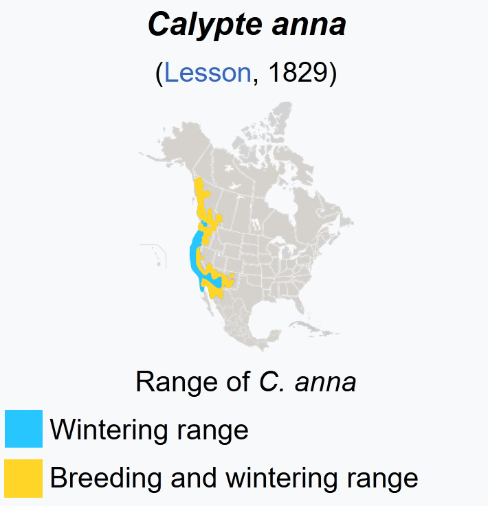
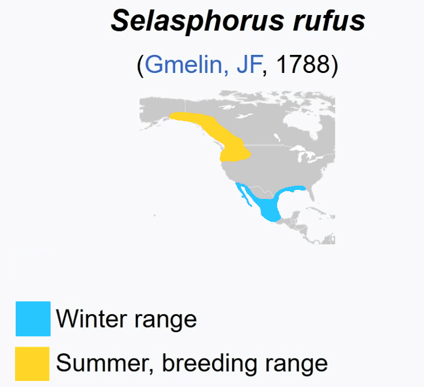
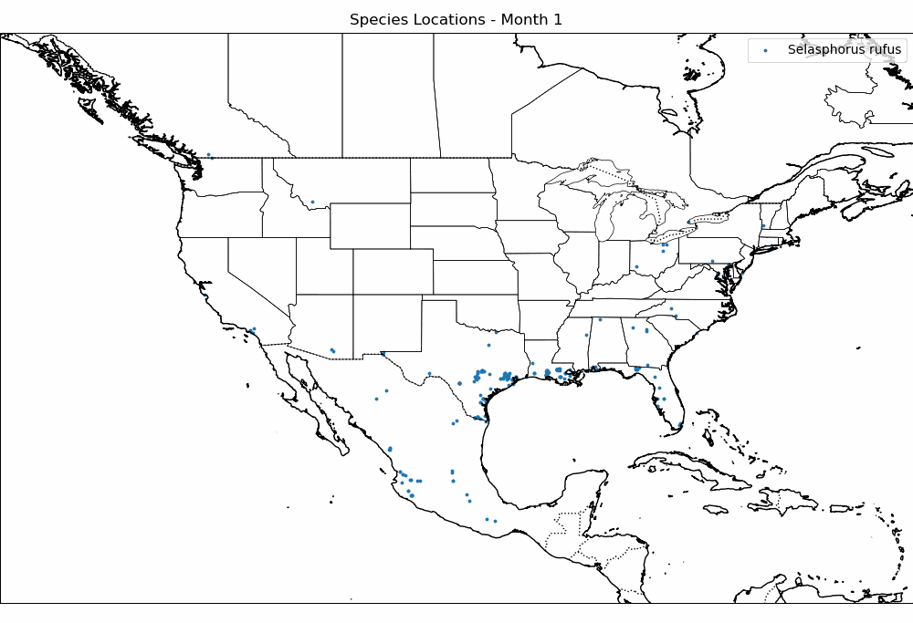

Reading time: `r ifelse(file.size("index.qmd")/2000 < 1, '<1 minute', paste0(round(file.size("index.qmd")/2000), ' minutes'))`

::: {.callout-note icon=false}
# Series Part 3

This is the third post in this deep-dive series.  
You can start from the beginning with [Part 1](https://galiwatch.ca/posts/hummer-data-cleaning-170323), or skip forward to [Part 4](/posts/hummer-cooccurrence-210823)
:::

## Setup

As previously covered in part i, we're looking at the hummingbird detection data from 2021. We did some preliminary data exploration, and saw some interesting patterns in the visit times of different birds.

```{r, message=F, warning=F, eval=F}
library(tidyverse)
library(lubridate)
library(patchwork)
library(ggpubr)

# classifier labels
classes = c('Rufous_Male', 'Annas_Male', 'Person_', 'Annas_Female', 'Rufous_Female')

# read in bird detection data, and do some basic data cleaning
bird <- read_csv('../hummer-data-cleaning-170323/bird_scaled.csv') %>%
  mutate(Month = month(Date, label = T))

```


## Migration patterns

A confounder we should carefully consider when looking at the data is the fact that not all the birds are present in equal proportions over time. The Anna and Rufous hummingbirds have two quite distinct migration patterns: Annas are year-round visitors to our feeder in BC, while the Rufouses tend to leave for Mexico about half way through the summer.


::: {layout-ncol="2"}




Adapted from Wikipedia
:::

## Visit patterns over the summer

```{r, eval=F}
p1 <- bird %>%
  ggplot() + 
  aes(x = Date, fill = Species) + 
  geom_histogram(bins=100, position='dodge') + 
  labs(y='Number of IDs', x='', title='Rufous Migrates Away in July',
       subtitle = 'Annas are present in BC year-round') + 
  scale_fill_manual(values=c('chartreuse3', 'chocolate2')) + 
  #facet_wrap('~Species') +
  theme_pubr() 

p2 <- bird %>% 
  ggplot() + 
  aes(x = Date, fill = Species, y=after_stat(count)) + 
  geom_density(bw=10, position='fill', show.legend = F, colour =NA) + 
  labs(y='Proportion of IDs') + 
  scale_fill_manual(values=c('chartreuse3', 'chocolate2'))+ 
  theme_pubr()


(p1 / p2) 

```
Here's a map made from citizen scientist data: each blue dot is a Rufous sighting reported to iNaturalist.


:::{.callout-note icon=false}
## `r emo::ji('brain')` Observation

There are a lot of Rufous ID's in the first half of the summer, peaking in the second week of June. there are almost no more Rufouses left by August. 
There are gaps in observations when the feeder ran out of food and was not re-filled for a long time (eg. June 1st-15th).
:::


 


The Male Rufous leave earlier than the Female: they're almost all gone by July. The latest dates we have for *manually confirmed* Rufous visits are:

-   Male: July 5th 2021
-   Female : July 31st 2021

```{r, eval=F}
p1 <- bird %>% 
  filter(Species == 'Rufous') %>%
  group_by(Month, Sex) %>% 
  filter(n() > 5) %>%
  ggplot() + 
  aes(x = Month, fill = Sex, y=after_stat(count)) + 
  geom_bar(position='fill', colour =NA)  + 
  labs(y='Proportion of IDs') + 
  scale_fill_manual(values=c('chocolate1', 'chocolate4'))+ 
  theme_pubr() + labs(title='Rufous')

p2 <- bird %>% 
  filter(Species == 'Annas') %>%
  group_by(Month, Sex) %>% 
  filter(n() > 5) %>%
  ggplot() + 
  aes(x = Month, fill = Sex, y=after_stat(count)) + 
  geom_bar(position='fill', colour =NA) + 
  labs(y='Proportion of IDs') + 
  scale_fill_manual(values=c('chartreuse1', 'chartreuse4'))+ 
  theme_pubr() + labs(title='Anna')

(p1) + (p2)
```

The Annas on the other hand, seem to hover around 1:3 Male to Female ID ratio, with the dramatic exception of April. This may have to do with female nesting behaviours, but we don't know for sure.


## Visiting Hours

I thought the hours of the day in which birds visit the feeder might give interesting insight into their behaviour. After poking around in the data, I found that visiting hours vary widely from month-to-month. In both species, we see a big dip in visits from 12-3pm in June. Our hypothesis is that this has to do with avoiding the sun or hottest temperatures in the middle of the day. June was an especially hot month for 2021, and there were lots of [forest fires](https://galiwatch.ca/posts/fires-2021). However, it's somewhat surprising to not also see this effect in July and August, which are generally similar to June in terms of weather.

```{r, eval=F}
bird %>%
  filter(Species == 'Rufous') %>%
  filter(Date < ymd('2021-08-01')) %>% 
  ggplot(aes(x=Hour, fill = Sex)) + 
  geom_bar(position = 'stack') + facet_wrap("~Month", scales='free_y') +
  scale_fill_manual(values=c('chocolate1', 'chocolate4')) + 
  labs(title='Rufous visit times vary by month', y = 'Number of IDs') + 
  theme_pubr()

```


:::{.callout-note icon=false}
## `r emo::ji('brain')` Observation

There are the most ID's in June, even though this is after all the males have migrated. 
:::


```{r, eval=F}

bird %>%
  filter(Species == 'Annas') %>%
  ggplot(aes(x=Hour, fill = Sex)) + 
  geom_bar(position='stack') + facet_wrap("~Month", scales='free_y') + 
  scale_fill_manual(values=c('chartreuse1', 'chartreuse4')) + 
  labs(title='Annas visit times vary by month', y = 'Number of IDs') + 
  theme_pubr()

```


:::{.callout-note icon=false}
## `r emo::ji('brain')` Observation

Almost all ID's in April are male. There's a big dip in ID's in the middle of June.
:::


## Weather data


Now we'll make use of the data from our weather station. I've created a column `MergeTime` in both dataframes, to make it easy to merge the bird and weather data. Read in and prepare the weather data

```{r, eval=F}
weather <-
  read_csv('WS_hours.csv') %>%
  # retain only non-duplicates
  distinct() %>%
  # Clean up timestamps, convert to celsius
  mutate(Date = ymd(Date), 
         MergeTime = ymd_hms(paste(Date, Time)),
         `Temp C` = (`Outdoor Temperature F`-32) * (5/9)
         )
```

The air quality measures show the concentration of particulates at three different size thresholds (in micrometers), as well as the outdoor air temperature recorded from April - December 2021.

```{r, echo=F, eval=F}
knitr::kable(head(weather))
```

## Temperature preferences

Based on the visiting hours plots, it seems like there may be a temperature effect in play, especially in June. To look into this, I made some linear regressions by month. There seemed to be some strong negative correlation in the hot months of June, July, August!

Relationship between temperature and number of visits differs by month.

```{r message=F, warning=F, eval=F}

merge(bird, weather, all.x=T) %>%
  filter(Species=='Rufous') %>%
  filter(Date < ymd('2021-08-01')) %>% 
  group_by(Month, Species) %>%
  mutate(`Temp C` = scale(`Temp C`)) %>%
  group_by(Month, Hour, Species) %>%
  summarise(n=n(), temp = median(`Temp C`, na.rm=T), .groups='keep') %>%
  ggplot(aes(x=temp, y = n))+ 
  geom_point(aes(colour = Month)) + 
  geom_smooth(method='lm', colour = 'chocolate4') +
  labs(title='Rufous', x='Temperature (C)', y = 'Number of Visits')+
  #facet_wrap("Month", nrow=2, scales = "free_y")+
  theme_pubr()
```

```{r message=F, warning=F, eval=F}

merge(bird, weather, all.x=T) %>%
  filter(Species=='Rufous') %>%
  filter(Date < ymd('2021-08-01')) %>% 
  group_by(Month, Hour, Species) %>%
  summarise(n=n(), temp = median(`Temp C`, na.rm=T), .groups='keep') %>%
  ggplot(aes(x=temp, y = n))+ 
  geom_point(colour = 'chocolate2') + 
  geom_smooth(method='lm', colour = 'chocolate4') +
  labs(title='Rufous', x='Temperature (C)', y = 'Number of Visits')+
  facet_wrap("Month", nrow=2, scales = "free_y")+
  theme_pubr()
```

```{r, eval=F}

merge(bird, weather, all.x=T) %>%
  filter(Species=='Annas') %>%
  group_by(Month, Hour, Species) %>%
  summarise(n=n(), temp = median(`Temp C`, na.rm=T), .groups='keep') %>%
  ggplot(aes(x=temp, y = n))+ 
  geom_point(colour = 'chartreuse3') + 
  geom_smooth(method='lm', colour = 'chartreuse4') +
  labs(title='Anna', x='Temperature (C)', y = 'Number of Visits')+
  facet_wrap("Month", scales = "free_y")+ 
  theme_pubr()

```

Both species seem to dislike temperatures above 20 degrees C. There's a fairly strong month-specific effect - this may reflect some behaviour changes based on the Rufous migration


## Hourly preferences

```{r message=F, warning=F, eval=F}

merge(bird, weather, all.x=T) %>%
  filter(Species=='Rufous') %>%
  filter(Date < ymd('2021-08-01')) %>% 
  group_by(Month, Hour, Species) %>%
  summarise(n=n(), temp = median(`Temp C`, na.rm=T), .groups='keep') %>%
  ggplot(aes(x=Hour, y = n))+ 
  geom_point(colour = 'chocolate2') + 
  geom_smooth(method='lm', colour = 'chocolate4') +
  labs(title='Rufous', x='Temperature (C)', y = 'Number of Visits')+
  facet_wrap("Month", nrow=2, scales = "free_y")+
  theme_pubr()
```

## Summary


:::{.callout-note icon=false}
## Read on to [Part 4 <i class="fa-solid fa-arrow-right"></i>](/posts/hummer-cooccurrence-210823)
:::


