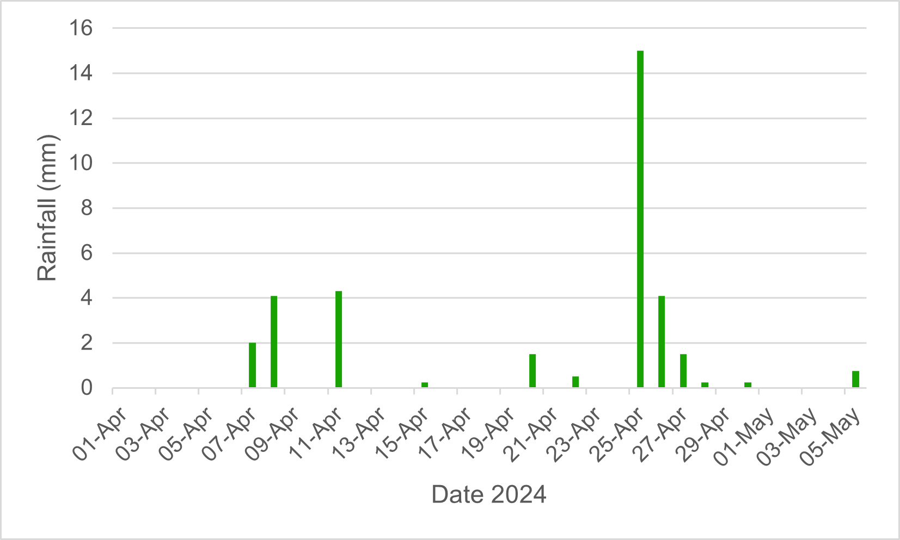
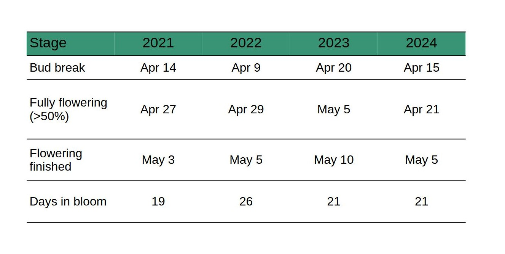
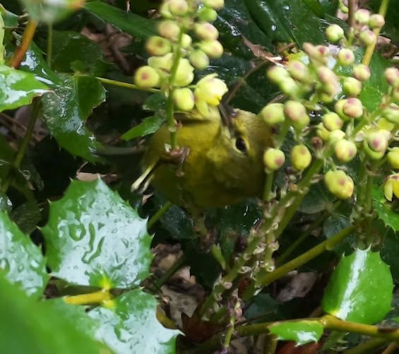

Reading time: `r ifelse(file.size("index.qmd")/2000 <= 1.5, '<1 minute', paste0(round(file.size("index.qmd")/2000), ' minutes'))`

## What we learned in 2024

We are continue to experiment with camera placement, and unfortunately this year was less optimal in that we were only able to identify the species of around 60% of visiting bumblebees. Nevertheless, we still have lots of data to play with.

First buds opened in the Oregon grape patch camera traps on April 15th (Cam 1) 16th (Cam 2). Data collection largely went well; although similar to last year, we lost a week of weather data due to power outages on the Island.

What we saw in 2024:

1.  Weather: average daily temperatures ranged from 8 to 11^o^C during April and early May
2.  Flowering: the Oregon grape bloomed at the mid-point of the bud-break time frame we have established over the 4 years of monitoring (Apr 9th - Apr 20th), and the blooming period of 21 days was similar to previous years.
3.  Fruit set: flowers were very productive with good fruit set
4.  Pollinators: total number of sightings of bumblebees (699) was the highest we have seen since we started monitoring in 2021. However species diversity was lower with only two bumblebee species reliably observed in the camera traps, and very few observations of solitary bees. (n= 401):

-   *Bombus flavifrons* (yellow-fronted bumblebee) - 93% of bee sightings (n=373)

-   *Bombus sitkensis* (Sitka bumblebee) - 6% of bee sightings (n=23)

-   Solitary bees - 1% of bee sightings (n=4)

5.  Bumblebees were seen within 12-24 hours of flowers opening, and unlike previous years *B. flavifrons* predominated unlike previous years when *B. sitkensis* was the most prevalent, perhaps reflecting the proximity of nest sites.
6.  There were very few other pollinators observed (no moths, stilt bugs, or stink bugs, as seen in 2023); although, we did see a small bird, identified as an orange crowned warbler, the obscure root weevil (*Sciopithes obscurus),* and a fly.
7.  We saw how banana slugs can impact Oregon grape blossom availability - flowering stems were cleared of blooms within an hour!!

## Surveillance set-up

We had two Raspberry Pi cameras set up on the Oregon grape patch collecting pics every 15s from dawn till dusk. When positioning the cameras, we look for locations where the plants are healthy and have several flower spikes emerging. The plants were looking good this spring, and we put one camera at the edge (Cam 1) and one at the centre (Cam 2) of the patch. We started collecting pictures in early April well before we expected the first buds to break.

{fig-align="center"}

## Weather and phenology

The Accurite weather station was affected by power outages on the Island so there was a week of missing data. We sourced rainfall data from the publicly available data for Saturna Island.

### Daily temperatures 2024

{fig-align="center"}

## Daily precipitation

{fig-align="center"}

### Annual variations in weather and phenology

Our four years of data collection show weather patterns in early spring at the Galiwatch site to be unpredictable with dryer conditions some years, variable average temperatures, and variable rainfall leading up to and during the Oregon grape blooming season.

After 4 years of monitoring we are beginning to establish ranges for spring weather conditions.

-   Average temperature in the two weeks prior to bloom ranges from 5 °C to 10 °C

-   Rainfall in the two weeks prior to bloom ranged from 3mm to 33.8mm over 2 to 9 days

-   Average temperature during blooming ranged from 9 °C to 12 °C

-   Rainfall during blooming ranged from 12.7mm to 96.5mm over 5 to 16 days

It's worth noting that 2022 was abnormally wet in coastal regions of BC as La Nina brought cold, damp weather in April and May with record breaking rain in April.

{fig-align="center" width="436"}

{fig-align="center"}

### Phenology and weather patterns

So far, spring weather in the weeks prior to bloom and during blooming of Oregon grape has been very variable from year-to-year with no clear link between rain, temperature and/or daylight hours on the timing of bud break. Here's what we have seen.

-   In three of the four years, bud break followed the day after a day-time high of [\>]{.underline}15 °C in 2021 (April 13th), 2022 (April 8th), and 2024 (April 14th).

-   Timing of bud break and blooming period was similar in 2021 and 2024, with first blooms opening in mid-April (14th/15th), and plants blooming for around 20 days.

-   In 2022 bud break was earlier; April 9th correlating with warm early spring conditions, but extreme rainfall and subsequent cool temperatures throughout April, with night-time lows below 2 °C some days, appeared to prolong blooming (26 days).

-   In 2023, day-time highs hovered between 10 and 12 °C throughout April, only reaching [\>]{.underline}15 °C at the end of the month (April 28th). Cooler early spring temperatures correlated with delayed bud break (April 20), indicating daytime highs of [\>]{.underline}15 °C are not essential for bud break, which suggests other factors such as daylight hours may also be involved.

-   Oregon grape is typically in flower for 3 weeks, but the time to fully flowering ([\>]{.underline}50% flowering) is very variable ranging from 6 days (2024) to 20 days (2022).

-   Flowering is typically over by the end of the first week of May.

{fig-align="center" width="515"}

{fig-align="center" width="490"}

## Bee count

Three of Galiano's known bumblebee species were caught in our camera traps at the Oregon grape patch, as well as some solitary bee species. This year we detected the most bees foraging that we have seen to date, but were only able to assign a species ID to around 60% of the sightings.

#### **Bee visitors on Oregon grape throughout flowering**

*Bombus flavifrons* - this bumblebee was the most frequently observed, accounting for 93% of observations we ID'd.

*Bombus sitkensis* - accounted for 6% of ID'd observations. Notably, from 2021 to 2023 *B. sitkensis* was the predominant bumble in our camera traps.

*Bombus mixtus* - just one sighting, so maybe questionable.

Solitary bees - accounted for 1% of sightings, down from 4% in 2023.

{fig-align="center"}

#### Species notes

*B. flavifrons* made up the vast majority of sightings on Oregon grape in 2024. Peak number of visits coincided with the time of full flowering ([\>]{.underline}50% flowering).

{fig-align="center"}

From 2021 to 2023, the predominant bee sightings were of *B. sitkensis* but this changed in 2024 with *B. flavifrons* taking the space. Despite this, we observed *B. sitkensis* foraging on the haskap berry patch, which begans flowering in mid-to-late March, as well as in early flowering heather, and on dandelions, which also start flowering in March.

Other early bee sightings included *B. melanopygus* and *B. vancouverensis*. These early bees are most likely queens emerging from hibernation, that are out foraging while looking for a nest sight.

Solitary bee sightings were much reduced compared with previous years, with just 4 records of bees that could be identified as solitary bees.

### Other pollinators and insects caught on camera

In previous years, in addition to bees on the Oregon grape, we also saw moths (Montana six-plumed moth and Western white-ribboned carpet moth), stilt bugs, the obscure root weevils, and brown stink bugs.

In 2024, there were no moths, no stilt bugs, and no stink bugs caught on camera. We did however have one sighting of a small bird that appeared to be collecting nectar, which was later identified on the Galiano Biodiversity Facebook page as an orange-crowned warbler (thanks to Pamela Janszen and Michael Hoebel). We also had one sighting of an obscure root weevil (feeding on the leaves), and possibly a mosquito - neither of which are likely pollinators, but were hanging out long enough to get caught on camera.

{fig-align="center" width="383"}

{fig-align="center" width="465"}

In addition to rain and cold here's a peak at what else bees are competing with for floral resources

.gif){fig-align="center" width="458"}