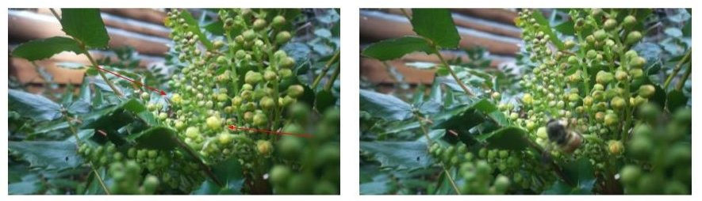

## What we learned in 2025



```{=html}
<div style="margin-top: 4em;"></div>
```

Oregon grape racemes were strong and healthy with lots of flower buds. The first buds opened on April 7th (CAM 2 centre of patch) and April 10th (CAM 1 edge of patch), a week earlier than in 2024, and 2 days earlier than ever previously observed.

Weather data collection went well through April, but power outages left us with no data from April 30th to May 4th. However, the plants under observation had finished flowering by April 30th. We were able to identify the species of bumblebee in 70% of the images (n=528 of 746). Images were blurred, or the bee was only partially in view in the remaining cases.

##### 2025 Summary

We are steadily building a picture of the changing weather patterns, and the ecological role of the Oregon grape patch as a floral resource in early spring for wild bees and other insects. Key findings include:

1.  Weather: average daily temperatures during blooming ranged from 8^o^C to 14^o^C, within the range observed in the previous 4 years.
2.  Flowering: Oregon grape bloomed particularly early in 2025, extending the bud-break time-frame from Apr 9th - Apr 20th to Apr 7th - Apr 20th. The blooming period was 23 days, similar to previous years.
3.  Fruit set: flowers were very productive with good fruit set, however many berries shriveled through June during warm, dry weather, leaving very few viable berries by July.
4.  Pollinators: we made over 800 sightings of pollinators, with a record number of bumblebees (746 compared to 699, the previous record observed in 2024). We were able to reliably identify 3 of Galiano's known bumblebee species:
    -   *Bombus flavifrons* (yellow-fronted bumblebee; n=201)

    -   *Bombus sitkensis* (Sitka bumblebee; n=312)

    -   *Bombus mixtus* (fuzzy-horned bumblebee; n=14)

    -   *Bombus melanopygus* (orange-rumped bumblebee; 1 observation)\
5.  As we have observed previously, bumblebees were quick to recognize that nectar is available, appearing within a few hours of the first flowers opening. The frequent appearance of *B. flavifrons* and *B. sitkensis* suggests continued successful nesting in proximity of the Oregeon grape patch.
6.  Solitary bees: we were able to identify *Andrena* (mining bees) and *Osmia* (mason bees) among the solitary bee sightings (n=59).
7.  Other visitors: these included ants, caterpillars, butterflies, flies and hover flies, beetles, spiders, wasps, weevils, and rufous humming birds, all caught on camera.
8.  Last year we saw a banana slug chomping down Oregon grape flowers; this year the bees were competing with deer!!

```{=html}
<div style="margin-top: 4em;"></div>
```

.gif){fig-align="center"}

```{=html}
<div style="margin-top: 4em;"></div>
```

## Weather and phenology

##### Daily temperatures 2025

April temperatures were variable, generally averaging below 10 ^o^C for the first half of the month, and warming up in the second half, reaching a high of 22.3 ^o^C on April 25th (hourly average). This is similar to 2023 when it was particularly warm towards the end of April and in early May.

```{=html}
<div style="margin-top: 4em;"></div>
```

##### Daily precipitation 2025

There were 9 days of rain during bloom time, ranging from small showers to downpours, for a total of 37.6mm for the month.

```{=html}
<div style="margin-top: 4em;"></div>
```

{fig-align="center"}

```{=html}
<div style="margin-top: 4em;"></div>
```

### Annual variations in weather and phenology

The effects of La Niña in spring can be highly variable and unpredictable - in 2025 we saw warm temperatures and variable precipitation.

In our 5th year of monitoring, we are now in a position to compare new observations to the range of observations we have observed in previous years. For this report, we have taken a look at the two weeks prior to when the Oregon grape started blooming, as well as the duration of blooming.

```{=html}
<div style="margin-top: 4em;"></div>
```

##### Daily temperatures and rainfall in 2025 compared to the range established for the previous 4 years

```{=html}
<table>
<thead>
<tr>
<th style="background-color:#376d61; color:white; text-align:center;">Temperature °C range 2021-2024</th>
<th style="background-color:#376d61; color:white; text-align:center;">2025 (°C)</th>
<th style="background-color:#376d61; color:white; text-align:center;">Rainfall range (mm)<br>2021 - 2024</th>
<th style="background-color:#376d61; color:white; text-align:center;">2025 (mm)</th>
</tr>
</thead>
<tbody>
<tr>
<td>5.3 - 12.4<br>(in the 14 days prior to bloom)</td>
<td>7.9 - 10.7<br>(in the 14 days prior to bloom)</td>
<td>3 - 33.8 (2 to 9 of the 14 days prior to bloom)</td>
<td>62.2 (9 days of the 14 days prior to bloom)</td>
</tr>
<tr>
<td>3.5 - 14.9<br>(in the 19 to 26 days in bloom)</td>
<td>8.1 - 14.0<br>(in the 23 days in bloom)</td>
<td>12.7 - 96.5 (5 to 16 days of the days in bloom)</td>
<td>37.6 (9 days of the 23 days in bloom)</td>
</tr>
</tbody>
</table>
```

Weather observations for 2025 fell within the ranges established for the previous 4 years, except for rainfall in the 2-weeks before Oregon grape buds opened. During this time there was almost double the rainfall than ever seen previously (maximum of 33.8 mm in 2022). By examining weather conditions prior to blooming we hope to establish how they affect bud break and bloom time of Oregon grape in the context of climate change.

```{=html}
<div style="margin-top: 4em;"></div>
```

##### Phenology - Oregon grape spring 2025

```{=html}
<table>
<thead>
<tr>
<th style="background-color:#376d61; color:white; text-align:left;">Stage</th>
<th style="background-color:#376d61; color:white; text-align:center;">Date range 2021-2024</th>
<th style="background-color:#376d61; color:white; text-align:center;">2025</th>
</tr>
</thead>
<tbody>
<tr>
<td>Bud break</td>
<td style="text-align:center;">Apr 9th - April 20th</td>
<td style="text-align:center;">Apr 7th</td>
</tr>
<tr>
<td>50% flowering</td>
<td style="text-align:center;">Apr 21 - May 5th</td>
<td style="text-align:center;">Apr 14th</td>
</tr>
<tr>
<td>Finished</td>
<td style="text-align:center;">May 3rd - May 10th</td>
<td style="text-align:center;">Apr 29th</td>
</tr>
<tr>
<td>Days in bloom</td>
<td style="text-align:center;">19 - 26</td>
<td style="text-align:center;">23</td>
</tr>
</tbody>
</table>
```

```{=html}
<div style="margin-top: 4em;"></div>
```

April 7th 2025 is the earliest date the Oregon grape has started flowering over the 5 years we have been surveying this patch. This extends the bud-break range from April 9th - April 20th to April 7th - Apr 20th. Similar to 2024, the plants reached 50% flowering within a week. As in previous years, plants were in bloom for around 3 weeks (23 days), but with an early finish before the end of April (April 29th).

## Bee count

Four of Galiano's known bumblebee species were caught on camera at the Oregon grape patch, as well as various solitary bee species (*Andrena* sp., *Osmia* sp.). It was another new record in terms of the total number of bees sighted nectaring (n=805), and we were able to assign species ID to 70% of the bumblebee images. There was just a single sighting of *B. melanopygus*, so questionable as regards the ID and unlikely that they are nesting in the area this spring. The consistent sightings of *B. flavifrons* and *B. sitkensis* indicate successful nesting close by, and despite a relatively low number of observations, *B. mixtus* was seen repeatedly throughout Oregon grape blooming from April 10th to April 24th.

##### **Visitors to Oregon grape throughout flowering**

```{=html}
<table>
<thead>
<tr>
<th style="background-color:#376d61; color:white; text-align:left;">Species</th>
<th style="background-color:#376d61; color:white; text-align:center;">Count</th>
<th style="background-color:#376d61; color:white; text-align:center;">% of observations</th>
</tr>
</thead>
<tbody>
<tr>
<td><em>B. flavifrons</em></td>
<td style="text-align:center;">201</td>
<td style="text-align:center;">24.</td>
</tr>
<tr>
<td><em>B. sitkensis</em></td>
<td style="text-align:center;">312</td>
<td style="text-align:center;">37.3</td>
</tr>
<tr>
<td><em>B. mixtus</em></td>
<td style="text-align:center;">14</td>
<td style="text-align:center;">1.7</td>
</tr>
<tr>
<td><em>B. melanopygus</em></td>
<td style="text-align:center;">1</td>
<td style="text-align:center;">0.1</td>
</tr>
<tr>
<td>Andrena</td>
<td style="text-align:center;">34</td>
<td style="text-align:center;">4.1</td>
</tr>
<tr>
<td>Mason bee</td>
<td style="text-align:center;">3</td>
<td style="text-align:center;">0.4</td>
</tr>
<tr>
<td>Other solitary</td>
<td style="text-align:center;">22</td>
<td style="text-align:center;">2.6</td>
</tr>
<tr>
<td>Unidentifiable bumblebees</td>
<td style="text-align:center;">218</td>
<td style="text-align:center;">26.1</td>
</tr>
<tr>
<td>Other visitors</td>
<td style="text-align:center;">31</td>
<td style="text-align:center;">3.7</td>
</tr>
<tr>
<td><strong>Total</strong></td>
<td style="text-align:center;"><strong>836</strong></td>
<td style="text-align:center;"><strong>100.0</strong></td>
</tr>
</tbody>
</table>
```

```{=html}
<div style="margin-top: 4em;"></div>
```

The number of bumblebee visits each day was relatively steady once the plants were in full flower (50% flower buds open), with fewer visits around the 20th and 21st when there was some rain.

```{=html}
<div style="margin-top: 4em;"></div>
```

{fig-align="center" width="494"}

```{=html}
<div style="margin-top: 4em;"></div>
```

#### Other notes and picture gallery

As previously we had a good turn out of *B. flavifrons* and *B. sitkensis,* and we also saw *B. mixtus* more frequently than previously.


```{=html}
<div style="margin-top: 4em;"></div>
```

This year we saw at least two *Andrena* sp. visiting on multiple occasions and nectaring for several minutes at a time.

{fig-align="center"}

```{=html}
<div style="margin-top: 4em;"></div>
```

And, although the mason bees (*Osmia*) were not provisioning frequently on Oregon grape, we had several nesting around our site.

```{=html}
<div style="margin-top: 4em;"></div>
```

{fig-align="center" width="273"}

```{=html}
<div style="margin-top: 4em;"></div>
```

#### Other pollinators and insects caught on camera

There was a lot of action this year in addition to bees, notably we had wasps nectaring on Oregon grape, which we haven't seen before, as well as flies, ants, wasps, weevils, and more!

```{=html}
<div style="margin-top: 4em;"></div>
```

{fig-align="center"}

```{=html}
<div style="margin-top: 4em;"></div>
```

{fig-align="center"}

```{=html}
<div style="margin-top: 4em;"></div>
```

Other wild bees that we saw in April and early May near our patch included *Bombus vancouverensis,* two species of *Sphecodes* (blood bees), and a digger bee, possibly *Habropoda*.

{fig-align="center"}

```{=html}
<div style="margin-top: 4em;"></div>
```

#### 

